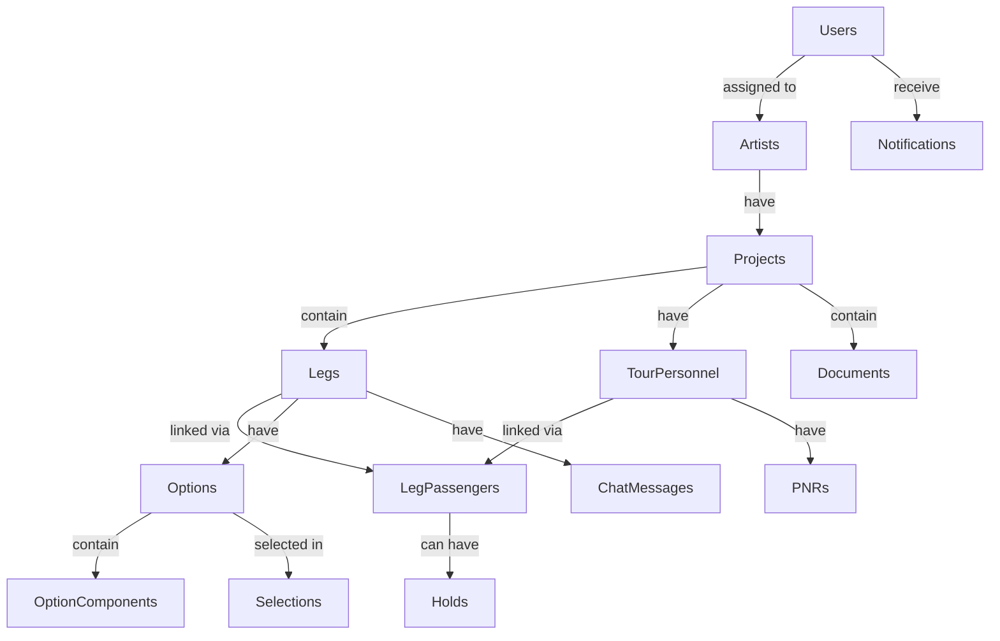

# Daysheets Flight Management System - Database Setup

## 🎯 Overview

This document outlines the comprehensive database schema implementation for the Daysheets Flight Management System, designed according to the approved specification.

## 🗄️ Database Schema

### Core Tables

1. **`users`** - Extends Supabase auth.users with roles (client/agent/admin)
2. **`artists`** - Artist/performer entities 
3. **`artist_assignments`** - Maps users to artists they can access

### Project & Tour Management

4. **`projects`** - Tours and standalone events (type: tour|event)
5. **`legs`** - Travel segments with optional labels
6. **`tour_personnel`** - Per-project passenger records (no cross-reuse)

### Flight Booking System

7. **`leg_passengers`** - Links personnel to legs (includes treat_as_individual flag)
8. **`options`** - Flight option groups for each leg
9. **`option_components`** - Individual flight segments within options

### Business Logic

10. **`selections`** - Client choices for flight options
11. **`holds`** - Per-passenger holds (24h expiry, no extensions)
12. **`pnrs`** - Passenger Name Records (one per passenger)

### Content & Communication

13. **`documents`** - PDF storage with is_current flag
14. **`chat_messages`** - One thread per leg
15. **`notifications`** - Role-scoped system notifications

## 🔐 Row Level Security (RLS)

### Security Model

- **Deny all by default** - All tables have RLS enabled with restrictive policies
- **Role-based access**:
  - **Clients**: Only see data for assigned artists
  - **Agents/Admins**: See all data with full management capabilities

### Key RLS Functions

- `is_agent_or_admin(user_id)` - Checks if user has elevated permissions
- `user_has_artist_access(user_id, artist_id)` - Validates artist access
- `user_has_project_access(user_id, project_id)` - Validates project access via artist

### Access Patterns

```sql
-- Clients can only see their assigned artists' data
SELECT * FROM projects WHERE user_has_artist_access(auth.uid(), artist_id);

-- Agents/Admins can see everything
SELECT * FROM projects WHERE is_agent_or_admin(auth.uid());
```

## ⚡ Performance Optimizations

### Critical Indexes

- **Relationship indexes**: All foreign keys indexed
- **Performance-critical joins** (as specified):
  - `leg_passengers` (leg_id, personnel_id)
  - `selections` (leg_id, option_id)
  - `holds` (personnel_id, expires_at)
  - `documents` (project_id, leg_id, is_current)
- **Date-based queries**: departure_date, start_date, hold expiry

### Query Optimization

- Composite indexes on frequently queried combinations
- Proper foreign key constraints for join performance
- Strategic use of partial indexes (e.g., `is_current = true`)

## 🔄 Business Logic

### Hold Management

- **24-hour expiry**: Automatic expiration via `expires_at` timestamp
- **No extensions**: Hard business rule enforced at database level
- **Automatic notifications**: Trigger sends expiry alerts

### Document Versioning

- **Current flag**: `is_current` marks active documents
- **Historical preservation**: Old documents persist until manually removed
- **Flexible association**: Documents can link to projects, legs, or personnel

### Communication

- **Thread per leg**: Each leg has its own chat thread
- **Role awareness**: Notifications scoped to user roles
- **Rich attachments**: JSONB field for file references

## 🚀 Deployment Instructions

### 1. Apply Migrations

The schema has been applied via Supabase MCP. All tables, indexes, and policies are in place.

### 2. Verify Setup

```bash
# Check tables were created
npm run db:status

# Verify RLS policies
npm run db:check-rls
```

### 3. Generate Updated Types

TypeScript types have been generated and updated in `lib/database.types.ts`.

## 📊 Data Model Relationships



## 🎛️ Enum Types

### User Roles
- `client` - Limited access to assigned artists
- `agent` - Full access for booking management  
- `admin` - System administration capabilities

### Project Types
- `tour` - Multi-city tour with multiple legs
- `event` - Single event (may still have multiple legs)

### Hold Status
- `active` - Hold is current and valid
- `expired` - Automatically expired after 24h
- `released` - Manually released by user

### PNR Status
- `pending` - Awaiting confirmation
- `confirmed` - Booking confirmed
- `cancelled` - Booking cancelled

### Notification Types
- `booking` - Flight booking updates
- `hold_expiry` - Hold expiration warnings
- `document` - Document uploads/updates
- `chat` - New chat messages
- `system` - System announcements

## 🔧 Automated Functions

### Hold Expiry Management
```sql
-- Function to expire holds automatically
SELECT expire_holds(); -- Run this periodically via cron
```

### Notification Triggers
- Hold expiry notifications sent automatically
- Extensible system for other notification types

## 📝 Usage Examples

### Creating a Project
```typescript
const { data: project } = await supabase
  .from('projects')
  .insert({
    artist_id: 'artist-uuid',
    name: 'World Tour 2024',
    type: 'tour',
    start_date: '2024-03-01',
    end_date: '2024-06-30'
  });
```

### Adding Personnel
```typescript
const { data: personnel } = await supabase
  .from('tour_personnel')
  .insert({
    project_id: 'project-uuid',
    full_name: 'John Doe',
    role_title: 'Tour Manager',
    is_vip: true
  });
```

### Booking Flow
```typescript
// 1. Create leg passengers
const { data: legPassenger } = await supabase
  .from('leg_passengers')
  .insert({
    leg_id: 'leg-uuid',
    personnel_id: 'personnel-uuid',
    treat_as_individual: false
  });

// 2. Place hold
const { data: hold } = await supabase
  .from('holds')
  .insert({
    personnel_id: 'personnel-uuid',
    option_id: 'option-uuid',
    leg_passenger_id: legPassenger.id,
    held_by: auth.user.id
  });

// 3. Make selection
const { data: selection } = await supabase
  .from('selections')
  .insert({
    leg_id: 'leg-uuid',
    option_id: 'option-uuid',
    selected_by: auth.user.id,
    is_final: true
  });
```

## ✅ Verification Checklist

- [x] 15 tables created with proper relationships
- [x] Row Level Security enabled on all tables
- [x] Performance indexes on critical joins
- [x] Business logic functions implemented
- [x] TypeScript types generated
- [x] Migration files documented
- [x] Automated triggers for hold expiry
- [x] Comprehensive RLS policies
- [x] Enum types properly defined
- [x] Foreign key constraints in place

## 🎉 Ready for Development!

The database is now fully configured and ready for application development. All tables include proper auditing (created_at, updated_at), security (RLS), and performance optimization (indexes).

Next steps:
1. Build frontend components using the generated types
2. Implement authentication flows
3. Create booking management interfaces
4. Add real-time features using Supabase subscriptions
